# cv_tools


<!-- WARNING: THIS FILE WAS AUTOGENERATED! DO NOT EDIT! -->

This file will become your README and also the index of your
documentation.

## Install

``` sh
git clone `git@github.com:HasanGoni/cv_tools.git`
cd cv_tools
pip install -e . 
```

- in case of github is not recognized with `ssh` then use

``` sh
git clone `https://github.com/HasanGoni/cv_tools.git`
cd cv_tools
pip install -e .
```

## How to use

you have a list of filenames with full path, but you are interested to
get only the name of the list in a vectorize format

``` python
HOME = Path.home()
DATA_PATH = Path(f'{HOME}/Schreibtisch/projects/data/microscopy')
MASK_PATH = Path(f'{DATA_PATH}/patch_train_masks/img_0_p_0.png')
IM_PATH = Path(f'{DATA_PATH}/patch_train_images/img_0_p_0.png')
DATA_PATH.ls()
```

    (#9) [Path('/home/hasan/Schreibtisch/projects/data/microscopy/patch_mask_train_coco_format.json'),Path('/home/hasan/Schreibtisch/projects/data/microscopy/patch_mask_val_coco_format.json'),Path('/home/hasan/Schreibtisch/projects/data/microscopy/patch_train_images.cache'),Path('/home/hasan/Schreibtisch/projects/data/microscopy/train_images'),Path('/home/hasan/Schreibtisch/projects/data/microscopy/patch_train_images'),Path('/home/hasan/Schreibtisch/projects/data/microscopy/patch_train_masks'),Path('/home/hasan/Schreibtisch/projects/data/microscopy/data.yaml'),Path('/home/hasan/Schreibtisch/projects/data/microscopy/train_msks'),Path('/home/hasan/Schreibtisch/projects/data/microscopy/yolo_dataset_train')]

``` python
path = Path(fr'{HOME}/Schreibtisch/projects/git_data')  
path_list = path.ls()
path_list
```

    (#7) [Path('/home/hasan/Schreibtisch/projects/git_data/senet_segmentation'),Path('/home/hasan/Schreibtisch/projects/git_data/segmentation_test'),Path('/home/hasan/Schreibtisch/projects/git_data/cv_tools_office'),Path('/home/hasan/Schreibtisch/projects/git_data/yolo_v8_segmentation'),Path('/home/hasan/Schreibtisch/projects/git_data/labeling_test'),Path('/home/hasan/Schreibtisch/projects/git_data/rc_files_for_me'),Path('/home/hasan/Schreibtisch/projects/git_data/cv_tools')]

``` python
get_name_(path_list)
```

    array(['fastsetup', 'fine_tune_SAM', 'cv_tools', 'labeling_test'],
          dtype='<U13')

### Reading image in PIL and opencv

- So you have some files, sometimes you wanted read image as `opencv`
  and sometimes you wanted to use `PIL` to read those image

``` python
# opencv image
img = read_img(
    im_path = IM_PATH,
    cv=True, # if PIL image just say cv=True, 
    gray=True # in case of color image just use gray=False
)
```

In case you want to see the image

``` python
show_(img)
```

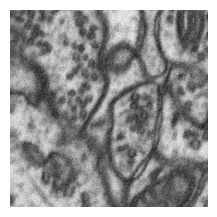

Same way we can see PIL image.

``` python
# PIL image
img = read_img(
    im_path = IM_PATH,
    cv=False, 
    gray=True # in case of color image just use gray=False
)
```

PIL image doesnot need `show` method in jupyter notebook. you can just
do following

``` python
img
```


``` python
# Visualize image
```

``` python
- In case of list of images need to be visualized
```

``` python
plot_images_grid(
    images=images,
    rows=1, # number of rows
    cols=2 # number of columns
)
```

### Cropping your image

- so you have an image, you want to do centercrop from this image, but
  you want to make sure, your image has a specific shape

- Remember here you need PIL Image. Opencv image can be easily converted
  using this `Image.fromarray`

``` python
img.size
```

    (256, 256)

our mask has a shape of `256,256`, lets centercrop it and make sure it
has a shape of `224,224`

``` python
crop_mask = center_crop(
        img, 
        desired_width=224,
        desired_height=224,
        height_offset=0,
        width_offset=0,
        cv=False
    )
```

``` python
print(f' crop image has a size of {crop_mask.size}')
crop_mask
```

     crop image has a size of (224, 224)

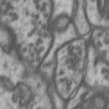

- If expected to have a opencv image, then use `cv=True`

``` python
crop_mask_ocv = center_crop(
        img, 
        desired_width=224,
        desired_height=224,
        height_offset=0,
        width_offset=0,
        cv=True
    )
```

``` python
show_(crop_mask_ocv)
```


#### Overlay Image and Mask

- In case of want to see overlay imagea and mask in a same image

``` python
overlay_mask(
    im_path=IM_PATH,
    msk_path=MASK_PATH,
    alpha=0.3 # visibility opacity
)
```


- Sometimes one needs to see not the mask but the border line of the
  mask

``` python
overlay_mask_border_on_image(
    im_path=IM_PATH,
    msk_path=MASK_PATH,
    save_new_img_path=None, # in case you want to save overlay mask then give path name
    border_width=1,
    show_=True

)
```


- Sometimes you want to compare another image to the overlay image, then
  just use this image
- just an example we are adding the mask again

``` python
new_image = cv2.cvtColor(read_img(IM_PATH, cv=True), cv2.COLOR_GRAY2RGB)
```

``` python
new_image.shape
```

    (256, 256, 3)

``` python
overlay_mask_border_on_image(
    im_path=IM_PATH,
    msk_path=MASK_PATH,
    new_img=new_image,
    save_new_img_path=None, # in case you want to save this new image
    border_width=1,
    show_=True

)
```

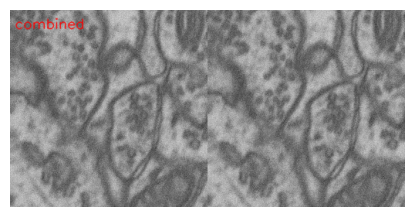

#### Concatenating images

- Sometimes you have 2 or more images, and you want to create a single
  image from these images
- if desired one small text can be added in this new image

``` python
images = [new_image, new_image]
```

``` python
combined_img = concat_images(
    images= images,
    rows=1,
    cols=2,
    number='combined'
)
```

``` python
show_(combined_img)
```


``` python
combined_img = concat_images(
    images= images,
    rows=2,
    cols=1,
    number='combined'
)
```

``` python
show_(combined_img)
```

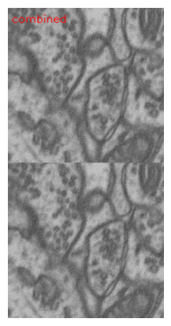

- So you have one image where could be lots of masks or single masks,
  you doesn’t want to see full image, but only mask part of the image,
  with image

``` python
IM_PATH.parent
```

    Path('/home/hasan/Schreibtisch/projects/data/microscopy/patch_train_images')

``` python
show_poster_from_path(
    mask_path=MASK_PATH,
    im_path=IM_PATH.parent, # Remember here not the full image path,\
                        #but only folder name, from this folder 
                        # Same file name as mask_path name will be
                        # searched
    show_='poster', # only mask
    text='test_poster'
)
```

    error: OpenCV(4.8.1) /io/opencv/modules/imgproc/src/resize.cpp:4065: error: (-215:Assertion failed) inv_scale_x > 0 in function 'resize'

    ---------------------------------------------------------------------------
    error                                     Traceback (most recent call last)
    Cell In[46], line 1
    ----> 1 show_poster_from_path(
          2     mask_path=MASK_PATH,
          3     im_path=IM_PATH.parent, # Remember here not the full image path,\
          4                         #but only folder name, from this folder 
          5                         # Same file name as mask_path name will be
          6                         # searched
          7     show_='poster', # only mask
          8     text='test_poster'
          9 )

    File ~/Schreibtisch/projects/git_data/cv_tools/cv_tools/core.py:340, in show_poster_from_path(mask_path, im_path, show_, text, scale)
        338     new_img = img_[y-offset:y+h+offset, x-offset:x+w+offset]
        339     images_list.append(new_img)
    --> 340 img_new = concat_images(images_list, row, col, number=text)
        343 # show imagess
        344 if show_ == 'both':

    File ~/Schreibtisch/projects/git_data/cv_tools/cv_tools/core.py:295, in concat_images(images, rows, cols, number)
        293 targe_h = min([i.shape[0] for i in images])
        294 target_w = min([i.shape[1] for i in images])
    --> 295 res_img = [cv2.resize(i, (target_w, targe_h)) for i in images]
        296 res = []
        297 for i in range(rows):

    File ~/Schreibtisch/projects/git_data/cv_tools/cv_tools/core.py:295, in <listcomp>(.0)
        293 targe_h = min([i.shape[0] for i in images])
        294 target_w = min([i.shape[1] for i in images])
    --> 295 res_img = [cv2.resize(i, (target_w, targe_h)) for i in images]
        296 res = []
        297 for i in range(rows):

    error: OpenCV(4.8.1) /io/opencv/modules/imgproc/src/resize.cpp:4065: error: (-215:Assertion failed) inv_scale_x > 0 in function 'resize'

- In case of single poster, it is not helpful, When you have lot’s of
  small objects, then may be it is interesting

#### Get Template part from an image

- So you have a template image, and you want to get this template from
  this image,
- following function will give bounding box (x, y, w, h format) of
  template part from this image

``` python
x, y, w, h=get_template_part(
    img=read_img(IM_PATH, cv=True),
    tmp_img=tmp_im_path
)
tmp_part = img[y:y +h, x: x+w]
```

``` python
> in case of only tempalte part is needed
tmp_part = get_template_part_img(
    im=img, # actual image
    tm_im=tmplate_image, # template image
)
```

#### Finding contour from a binary mask

``` python
img = read_img(IM_PATH, cv=True, gray=True)
```

``` python
contours = find_contours_binary(
    img
)
len(contours)
```

    1

#### Apply multiple thresholding in an image

- You have any image, and you want to segment it based on its value

``` python
img = read_img(IM_PATH, cv=True, gray=True)
```

``` python
thrs_img = multi_otsu(img, classes=3)
```

``` python
show_(thrs_img)
```


#### Split Image

- So you have an image, and you want to cut your images in smaller
  parts.
- last part will not be same like other parts, because possible extra
  part or smaller part

``` python
splitted_parts = split_image(img, num_splits=3, direction='horizontal')
show_(splitted_parts)
```

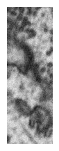

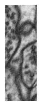

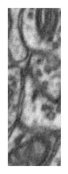

``` python
splitted_parts_v = split_image(img, num_splits=3, direction='vertical')
show_(splitted_parts_v)
```

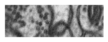

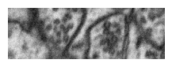


# Background Normalization

#### Correction of Masks

- So you have a binary mask, but there are some small holes in that mask
- so want to fill those holes inside your mask

``` python
filled_mask = fill_holes_in_objects(binaray_mask)
```

- Sometimes you have some smaller parts in your masks and you want to
  remove those smaller parts from the mask

``` python
remove_small_objects(
    binary_mask=binary_mask,
    size_threshold=size_threshold
)
```

- May be you want to see each object in the mask put a number in each
  object and based on this number, you just remove a object from the
  mask

``` python
labels, new_labels = show_labeled_mask(
    msk_path
)
```

``` python
remove_object_from_mask(mask, object_id_list=[1])
```

#### check data

- in case of check validity of mask, you can create a overlay mask and
  check if it is correct or not,
  - `overlay_mask_path` - is the saved image path
  - `move_path` - is the path where you want to move the mask ( in case
    of mask is not correct)
  - `im_height` - height of the image

``` python
display_image_row(
    im_path=overlay_mask_path,
    move_path=move_path,
    max_images=10,
    start=0,
    im_height=200,
    im_width=200,

)
```

``` python
img, _=get_single_sample(
    split='train',
    INDEX=0,
    name='hasangoni/Electron_microscopy_dataset',
    type='numpy'
)
```

``` python
b_img = rolling_ball_substraction(image=img, radius=50)
b_img_60 = rolling_ball_substraction(image=img, radius=60)
b_img_70 = rolling_ball_substraction(image=img, radius=70)
b_img_90 = rolling_ball_substraction(image=img, radius=90)
b_img_100 = rolling_ball_substraction(image=img, radius=100)
```

``` python
show_images_(
    images=[img, b_img, b_img_60, b_img_70, b_img_90, b_img_100], 
    titles=[
        'Original', 
        'Rolling Ball Subtraction with radius 50', 
        'Rolling Ball Subtraction with radius 60', 
        'Rolling Ball Subtraction with radius 70', 
        'Rolling Ball Subtraction with radius 90', 
        'Rolling Ball Subtraction with radius 100'])
```

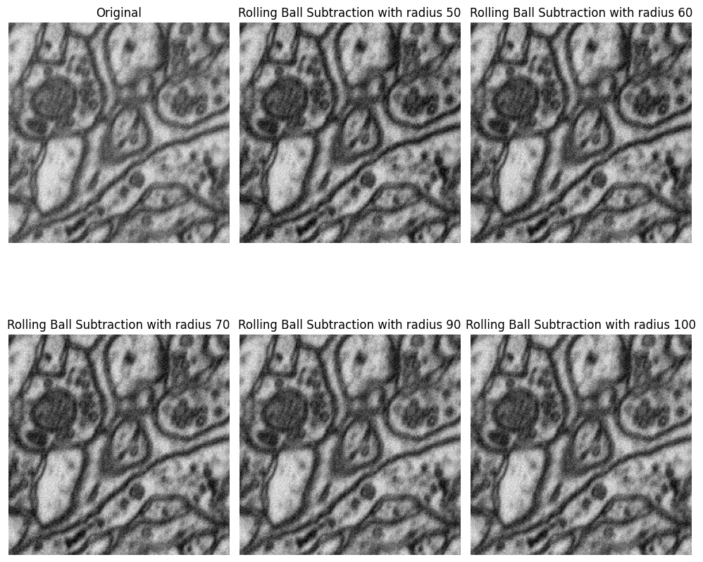

``` python
flat_field_img = flat_field_correction(
    image=img,
    background_estimate=None,
    sigma=50,
)

show_images_(
    images=[img, flat_field_img], 
    titles=['Original', 'Flat Field Correction'])
```

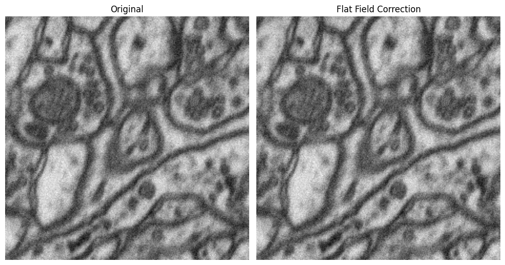

``` python
adaptive_img = adaptive_background_normalization(
    image=img,
    block_size=64,
    method='mean',
)

adaptive_img_median = adaptive_background_normalization(
    image=img,
    block_size=64,
    method='median',
)

morphological_img = morphological_background_removal(
    image=img,
    kernel_size=15,
)
frequency_img = frequency_domain_background_removal(
    image=img,
    cutoff_frequency=0.1,
)
multi_scale_img = multi_scale_background_removal(
    image=img,
    scales=[10, 30, 50],
)
processed_img = process_image_background_normalization(
    image_path=img,
    method='combined',
)

show_images_(
    images=[img, adaptive_img, adaptive_img_median, morphological_img, frequency_img, multi_scale_img, processed_img], 
    titles=[
        'Original', 'Adaptive Mean', 'Adaptive (Median)', 
        'Morphological Background Removal', 'Frequency Domain Background Removal', 
        'Multi-scale Background Removal', 'combined'])
```

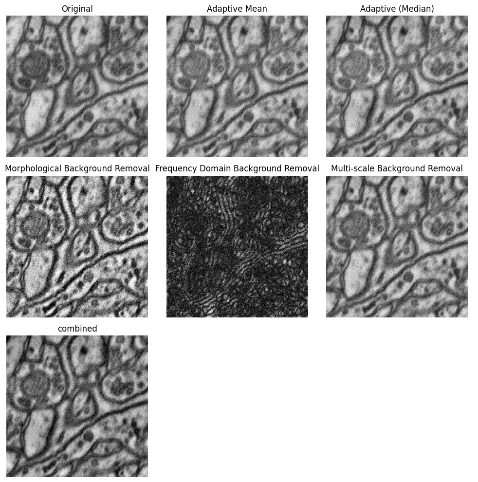

**process_images_parallel_bg_normalization** is also implemented

## Compress and filter

``` python
im_path = Path(r'/home/ai_sintercra.work/Fail_start20240402/_unzip/main_im2_cropped')
msk_path = Path(im_path.parent, 'main_im2_cropped_masks')
convert_image_to_parquet_p(
    im_path=im_path,
    file_name_func=None,
    file_exts='.png',
    threadpool=False)
```

### decode image if the image size small

``` python
images = read_images_from_parquet(
    parquet_path=Path(parquet_path)
    num_workers=4
)
```

### decode image if the image size big

``` python
decode_batch(
    pr_path=Path(pr_path),
    batch_size=600,
    num_workers=4, 
    output_dir=Path(output_dir)
)
```

# Get interactive interface to get coordinates of the image

``` python
interactive_get_coordinates(
    img=img) # image will be image
```

> then it will create an interactive interface you need to click
> bounding box of the image, - r -reset - Escapae- done - after that you
> will get a list of coordinates of the image
