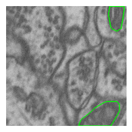

# cv_tools

::: {.cell 0=‘h’ 1=‘i’ 2=‘d’ 3=‘e’ execution_count=1}

``` python
from cv_tools.core import *
from cv_tools.cv_ops import *
```

:::

> computer vision related tools

This file will become your README and also the index of your
documentation.

## Install

``` sh
git clone `git@github.com:HasanGoni/cv_tools.git`
cd cv_tools
pip install -e . 
```

- in case of github is not recognized with `ssh` then use

``` sh
git clone `https://github.com/HasanGoni/cv_tools.git`
cd cv_tools
pip install -e .
```

## How to use

you have a list of filenames with full path, but you are interested to
get only the name of the list in a vectorize format

::: {.cell 0=‘h’ 1=‘i’ 2=‘d’ 3=‘e’ execution_count=2}

``` python
from fastcore.all import *
#from cv_tools.core import *
import cv2
from typing import Union, List, Any, Tuple, Dict, Callable 
from PIL import Image
from pathlib import Path
import numpy as np
import matplotlib.pyplot as plt
import matplotlib as mpl
dpi = mpl.rcParams['figure.dpi']
mpl.rcParams['image.cmap']='gray'
```

:::

``` python
HOME = Path.home()
DATA_PATH = Path(f'{HOME}/Schreibtisch/projects/data/microscopy')
MASK_PATH = Path(f'{DATA_PATH}/patch_train_masks/img_0_p_0.png')
IM_PATH = Path(f'{DATA_PATH}/patch_train_images/img_0_p_0.png')
DATA_PATH.ls()
```

    (#9) [Path('/home/hasan/Schreibtisch/projects/data/microscopy/patch_mask_train_coco_format.json'),Path('/home/hasan/Schreibtisch/projects/data/microscopy/patch_mask_val_coco_format.json'),Path('/home/hasan/Schreibtisch/projects/data/microscopy/patch_train_images.cache'),Path('/home/hasan/Schreibtisch/projects/data/microscopy/train_images'),Path('/home/hasan/Schreibtisch/projects/data/microscopy/patch_train_images'),Path('/home/hasan/Schreibtisch/projects/data/microscopy/patch_train_masks'),Path('/home/hasan/Schreibtisch/projects/data/microscopy/data.yaml'),Path('/home/hasan/Schreibtisch/projects/data/microscopy/train_msks'),Path('/home/hasan/Schreibtisch/projects/data/microscopy/yolo_dataset_train')]

``` python
path = Path(fr'{HOME}/Schreibtisch/projects/git_data')  
path_list = path.ls()
path_list
```

    (#7) [Path('/home/hasan/Schreibtisch/projects/git_data/senet_segmentation'),Path('/home/hasan/Schreibtisch/projects/git_data/segmentation_test'),Path('/home/hasan/Schreibtisch/projects/git_data/cv_tools_office'),Path('/home/hasan/Schreibtisch/projects/git_data/yolo_v8_segmentation'),Path('/home/hasan/Schreibtisch/projects/git_data/labeling_test'),Path('/home/hasan/Schreibtisch/projects/git_data/rc_files_for_me'),Path('/home/hasan/Schreibtisch/projects/git_data/cv_tools')]

``` python
get_name_(path_list)
```

    array(['fastsetup', 'fine_tune_SAM', 'cv_tools', 'labeling_test'],
          dtype='<U13')

### Reading image in PIL and opencv

- So you have some files, sometimes you wanted read image as `opencv`
  and sometimes you wanted to use `PIL` to read those image

``` python
# opencv image
img = read_img(
    im_path = IM_PATH,
    cv=True, # if PIL image just say cv=True, 
    gray=True # in case of color image just use gray=False
)
```

In case you want to see the image

``` python
show_(img)
```


Same way we can see PIL image.

``` python
# PIL image
img = read_img(
    im_path = IM_PATH,
    cv=False, 
    gray=True # in case of color image just use gray=False
)
```

PIL image doesnot need `show` method in jupyter notebook. you can just
do following

``` python
img
```


### Cropping your image

- so you have an image, you want to do centercrop from this image, but
  you want to make sure, your image has a specific shape

- Remember here you need PIL Image. Opencv image can be easily converted
  using this `Image.fromarray`

``` python
img.size
```

    (256, 256)

our mask has a shape of `256,256`, lets centercrop it and make sure it
has a shape of `224,224`

``` python
crop_mask = center_crop(
        img, 
        desired_width=224,
        desired_height=224,
        height_offset=0,
        width_offset=0,
        cv=False
    )
```

``` python
print(f' crop image has a size of {crop_mask.size}')
crop_mask
```

     crop image has a size of (224, 224)


- If expected to have a opencv image, then use `cv=True`

``` python
crop_mask_ocv = center_crop(
        img, 
        desired_width=224,
        desired_height=224,
        height_offset=0,
        width_offset=0,
        cv=True
    )
```

``` python
show_(crop_mask_ocv)
```



#### Overlay Image and Mask

- In case of want to see overlay imagea and mask in a same image

``` python
overlay_mask(
    im_path=IM_PATH,
    msk_path=MASK_PATH,
    alpha=0.3 # visibility opacity
)
```


- Sometimes one needs to see not the mask but the border line of the
  mask

``` python
overlay_mask_border_on_image(
    im_path=IM_PATH,
    msk_path=MASK_PATH,
    save_new_img_path=None, # in case you want to save overlay mask then give path name
    border_width=1,
    show_=True

)
```


- Sometimes you want to compare another image to the overlay image, then
  just use this image
- just an example we are adding the mask again

``` python
new_image = cv2.cvtColor(read_img(IM_PATH, cv=True), cv2.COLOR_GRAY2RGB)
```

``` python
new_image.shape
```

    (256, 256, 3)

``` python
overlay_mask_border_on_image(
    im_path=IM_PATH,
    msk_path=MASK_PATH,
    new_img=new_image,
    save_new_img_path=None, # in case you want to save this new image
    border_width=1,
    show_=True

)
```


#### Concatenating images

- Sometimes you have 2 or more images, and you want to create a single
  image from these images
- if desired one small text can be added in this new image

``` python
images = [new_image, new_image]
```

``` python
combined_img = concat_images(
    images= images,
    rows=1,
    cols=2,
    number='combined'
)
```

``` python
show_(combined_img)
```


``` python
combined_img = concat_images(
    images= images,
    rows=2,
    cols=1,
    number='combined'
)
```

``` python
show_(combined_img)
```


- So you have one image where could be lots of masks or single masks,
  you doesn’t want to see full image, but only mask part of the image,
  with image

``` python
IM_PATH.parent
```

    Path('/home/hasan/Schreibtisch/projects/data/microscopy/patch_train_images')

``` python
show_poster_from_path(
    mask_path=MASK_PATH,
    im_path=IM_PATH.parent, # Remember here not the full image path,\
                        #but only folder name, from this folder 
                        # Same file name as mask_path name will be
                        # searched
    show_='poster', # only mask
    text='test_poster'
)
```

    error: OpenCV(4.8.1) /io/opencv/modules/imgproc/src/resize.cpp:4065: error: (-215:Assertion failed) inv_scale_x > 0 in function 'resize'

- In case of single poster, it is not helpful, When you have lot’s of
  small objects, then may be it is interesting

#### Get Template part from an image

- So you have a template image, and you want to get this template from
  this image,
- following function will give bounding box (x, y, w, h format) of
  template part from this image

``` python
x, y, w, h=get_template_part(
    img=read_img(IM_PATH, cv=True),
    tmp_img=tmp_im_path
)
tmp_part = img[y:y +h, x: x+w]
```

#### Finding contour from a binary mask

``` python
img = read_img(IM_PATH, cv=True, gray=True)
```

``` python
contours = find_contours_binary(
    img
)
len(contours)
```

    1

#### Apply multiple thresholding in an image

- You have any image, and you want to segment it based on its value

``` python
img = read_img(IM_PATH, cv=True, gray=True)
```

``` python
thrs_img = multi_otsu(img, classes=3)
```

``` python
show_(thrs_img)
```


#### Split Image

- So you have an image, and you want to cut your images in smaller
  parts.
- last part will not be same like other parts, because possible extra
  part or smaller part

``` python
splitted_parts = split_image(img, num_splits=3, direction='horizontal')
show_(splitted_parts)
```


``` python
splitted_parts_v = split_image(img, num_splits=3, direction='vertical')
show_(splitted_parts_v)
```


#### Correction of Masks

- So you have a binary mask, but there are some small holes in that mask
- so want to fill those holes inside your mask

``` python
filled_mask = fill_holes_in_objects(binaray_mask)
```

- Sometimes you have some smaller parts in your masks and you want to
  remove those smaller parts from the mask

``` python
remove_small_objects(
    binary_mask=binary_mask,
    size_threshold=size_threshold
)
```

- May be you want to see each object in the mask put a number in each
  object and based on this number, you just remove a object from the
  mask

``` python
labels, new_labels = show_labeled_mask(
    msk_path
)
```

``` python
remove_object_from_mask(mask, object_id_list=[1])
```

#### check data

- in case of check validity of mask, you can create a overlay mask and
  check if it is correct or not,
  - `overlay_mask_path` - is the saved image path
  - `move_path` - is the path where you want to move the mask ( in case
    of mask is not correct)
  - `im_height` - height of the image

``` python
display_image_row(
    im_path=overlay_mask_path,
    move_path=move_path,
    max_images=10,
    start=0,
    im_height=200,
    im_width=200,

)
```
